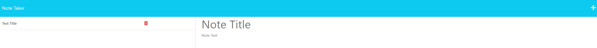
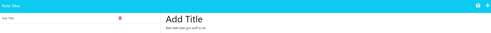
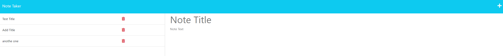
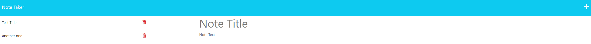

# Note Taker

## Description
A user can add notes with text and a title and delete them when finished or no longer needed. 

## Table of Contents
* [Installation](#installation)
* [Usage](#usage) 
* [License](#license)
* [Tests](#tests)
* [Credit](#credit)
* [Questions](#questions)

## Installation
To install necessary dependencies, run the following command in the terminal using node.js:
express is install with npm i

## Usage 
To run this locally: install dependencies then start server with "node index.js"

Notice the save button rendered top right

Delete any note

## License
This project is licensed under the MIT license.

## Tests
To run tests, run the following command:
NA
    
## Credit
GitHub: [joshuagoeke](https://github.com/joshuagoeke) 

## Questions
Constact through email or Github

Email: zechariahbarrett@outlook.com

GitHub: [zechb7](https://github.com/zechb7) 